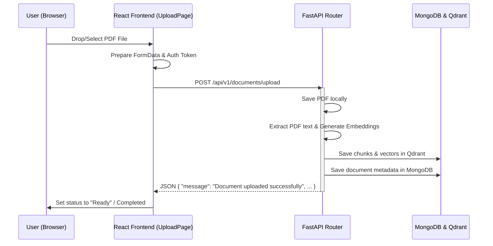

# Document Upload API Call Flow

This document details exactly how and where the Document Upload API (`/upload`) is defined on the backend and called/integrated in the frontend application.

---

## 1. Backend API Definition

The document upload endpoint is implemented using **FastAPI** on the backend.

### Router Mounting
* **File Path:** [server/app/api/\_\_init\_\_.py](file:///c:/LegalEye/server/app/api/__init__.py#L6)
* **Code Line:** 
  ```python
  api_router.include_router(documents.router, prefix="/documents", tags=["documents"])
  ```
  *The router containing document endpoints is mounted under the prefix `/documents`.*

* **File Path:** [server/main.py](file:///c:/LegalEye/server/main.py#L33)
* **Code Line:**
  ```python
  app.include_router(api_router, prefix=settings.API_V1_STR)
  ```
  *The base API router is mounted under the `/api/v1` prefix. Combined, this forms the base URL path `/api/v1/documents` for all document operations.*

### Endpoint Definition
* **File Path:** [server/app/api/endpoints/documents.py](file:///c:/LegalEye/server/app/api/endpoints/documents.py#L30-L35)
* **Code Definition:**
  ```python
  @router.post("/upload", response_model=DocumentUploadResponse)
  async def upload_document(
      file: UploadFile = File(...),
      db = Depends(get_database),
      current_user: dict = Depends(get_current_user)
  ):
  ```
  * **HTTP Method:** `POST`
  * **Final URL Path:** `/api/v1/documents/upload`
  * **Functionality:** Validates that the file is a PDF, saves it locally in the `uploads/` directory, extracts the text content, generates embeddings via AI services, stores vector chunks into Qdrant for search, indexes metadata in MongoDB, and associates it with the authenticated user.

---

## 2. Frontend API Call

The frontend is a React application that communicates with the FastAPI backend.

### The Network Request
* **File Path:** [client/src/pages/UploadPage.jsx](file:///c:/LegalEye/client/src/pages/UploadPage.jsx#L64-L93)
* **Code snippet:**
  ```javascript
  const uploadFile = async (fileObj) => {
    const formData = new FormData();
    formData.append('file', fileObj.file);

    try {
      const response = await fetch(`${API_URL}/documents/upload`, {
        method: 'POST',
        headers: {
          'Authorization': `Bearer ${user?.token || ''}`
        },
        body: formData,
      });

      if (!response.ok) {
        const errorData = await response.json();
        throw new Error(errorData.detail || 'Upload failed');
      }

      const data = await response.json();
      
      setFiles(prev => prev.map(f => 
        f.id === fileObj.id ? { ...f, progress: 100, status: 'completed' } : f
      ));
    } catch (error) {
      console.error('Upload error:', error);
      setFiles(prev => prev.map(f => 
        f.id === fileObj.id ? { ...f, status: 'error', error: error.message } : f
      ));
    }
  };
  ```

### How the Upload Page is Triggered
The user navigates to the `/dashboard/upload` page (rendered by `UploadPage.jsx`) from multiple locations in the client application:

1. **Sidebar Navigation Link**
   * **File Path:** [client/src/components/sidebar/Sidebar.jsx](file:///c:/LegalEye/client/src/components/sidebar/Sidebar.jsx#L58)
   * **Action:** Clicking on the "Upload" menu item redirects the user to `/dashboard/upload`.
   * **Code snippet:**
     ```javascript
     { icon: Upload, label: 'Upload', to: '/dashboard/upload' }
     ```

2. **Dashboard Quick Action Button**
   * **File Path:** [client/src/pages/DashboardPage.jsx](file:///c:/LegalEye/client/src/pages/DashboardPage.jsx#L117)
   * **Action:** Direct button action for users to upload files directly from the main dashboard overview page.
   * **Code snippet:**
     ```javascript
     <Button onClick={() => navigate('/dashboard/upload')}>
     ```

3. **Library Empty/Action Button**
   * **File Path:** [client/src/pages/LibraryPage.jsx](file:///c:/LegalEye/client/src/pages/LibraryPage.jsx#L147)
   * **Action:** Provides an option to navigate to the upload page when looking at the documents list.
   * **Code snippet:**
     ```javascript
     <Button onClick={() => navigate('/dashboard/upload')}>Upload Documents</Button>
     ```

---

## 3. Summary of Data Flow

